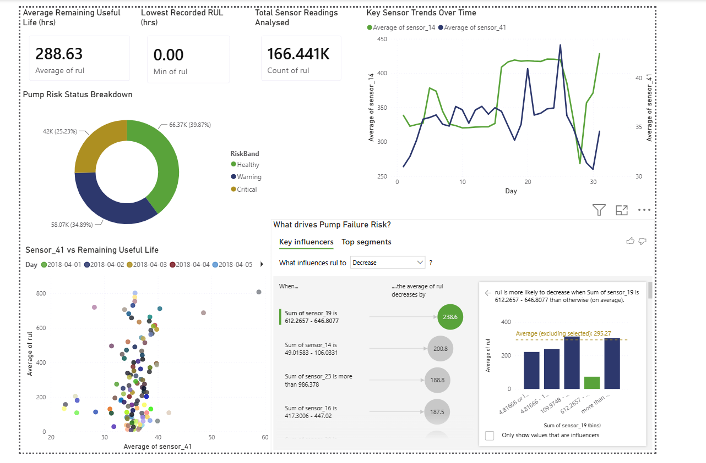

# Power BI Predictive Maintenance Dashboard

This is a Power BI project I created to practise working with sensor data, asset health analysis and predictive maintenance reporting.

The dashboard uses industrial water pump sensor readings to look at equipment condition and Remaining Useful Life (RUL). I wanted to build something that was closer to real operational data, rather than just doing a general dashboard project.

## Dashboard

## What I worked on

- Cleaned and prepared the sensor data using Power Query
- Checked the dataset for flat-lined and non-useful sensor variables
- Worked with over 166,000 sensor readings
- Created risk bands to group readings into Healthy, Warning and Critical
- Built KPI cards, trend charts, a scatter chart and a risk breakdown chart
- Used Power BI’s Key Influencers feature to explore which sensor readings were linked to a decrease in Remaining Useful Life
- Presented the results in a dashboard format so the main equipment health indicators were easier to understand

## Main findings

One of the main findings was that around 34.9% of the sensor readings fell into the Critical risk band. The Key Influencers visual also helped identify sensor ranges that were linked to a lower Remaining Useful Life.

This helped me understand how dashboarding can be used for more than just showing data. It can also help highlight risk, support maintenance decisions and make large datasets easier to interpret.

## Tools used

- Power BI
- Power Query
- Calculated columns
- Key Influencers visual
- Data cleaning
- Data visualisation

## Note

The full Power BI file and dataset are not included because of file size limits. This repository includes a screenshot of the dashboard and a summary of the project.
